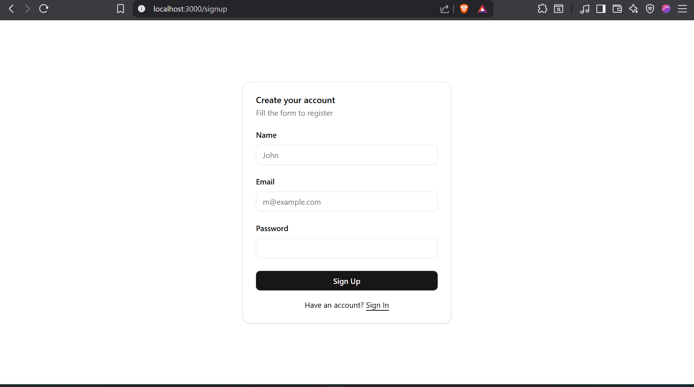
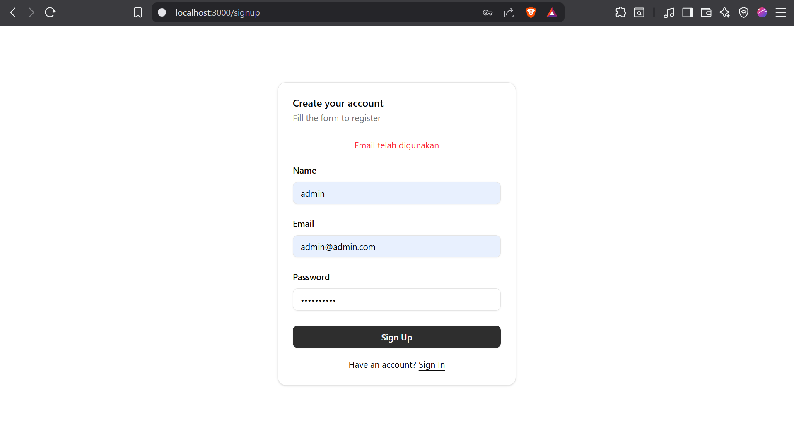
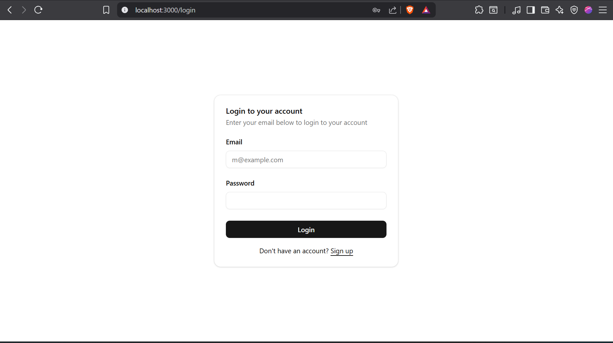
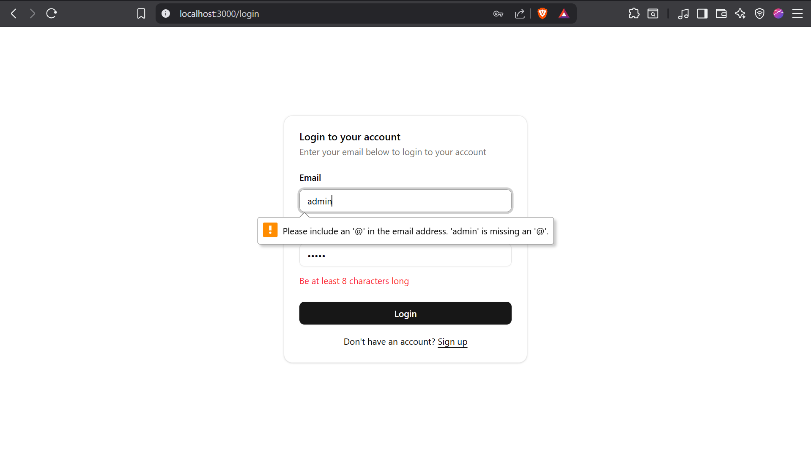
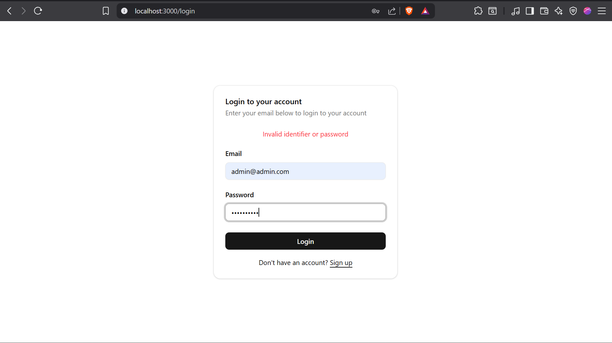
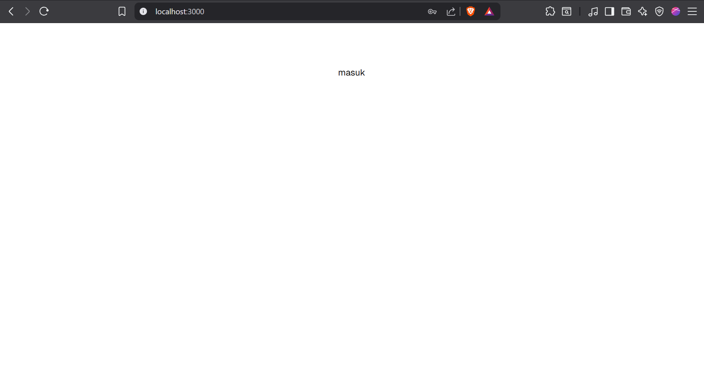
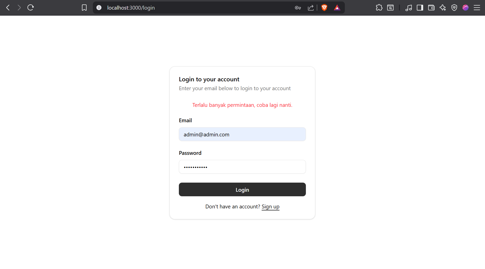

# Simple Auth

Sistem autentikasi sederhana dengan pendekatan Domain-Driven Design (DDD), menggunakan Express di backend dan Next.js di frontend. Proyek ini menerapkan berbagai best practice keamanan serta manajemen state token menggunakan JWT.

---

## Fitur Utama

- Registrasi user dengan validasi dan hashing password
- Login dan otentikasi menggunakan JWT
- Proteksi API dengan rate limiting
- Middleware keamanan HTTP headers
- Arsitektur kode berdasarkan prinsip Domain-Driven Design (DDD)

---

## Teknologi dan Library

| Library                 | Fungsi Utama                | Alasan Pemilihan                                    |
| ----------------------- | --------------------------- | --------------------------------------------------- |
| **express**             | Framework web server        | Ringan, fleksibel, komunitas besar                  |
| **bcrypt**              | Hash password               | Standar industri hashing password                   |
| **jsonwebtoken**        | Generate dan verifikasi JWT | Token-based auth yang aman dan terstandarisasi      |
| **express-rate-limit**  | Membatasi request masuk     | Cegah brute force dan abuse API                     |
| **class-validator**     | Validasi data input         | Validasi otomatis berbasis dekorator di TypeScript  |
| **class-transformer**   | Transformasi objek input    | Mempermudah konversi plain object ke class instance |
| **typeorm**             | ORM untuk PostgreSQL        | Query aman, migrasi mudah, dukungan relasi          |
| **pg**                  | PostgreSQL driver           | Stabil dan kompatibel dengan database PostgreSQL    |
| **routing-controllers** | Struktur REST API           | Membuat controller yang bersih dan modular          |
| **tsyringe**            | Dependency Injection        | Manajemen dependensi yang mudah dan scalable        |

---

## Arsitektur

Menggunakan **Domain-Driven Design (DDD)** dengan pemisahan tanggung jawab:

- **Entities** sebagai model domain
- **Repositories** untuk abstraksi akses data dengan TypeORM
- **Services** mengelola proses bisnis
- **Controllers** menangani request dan response API

---

## Keamanan

- Middleware men-set HTTP security headers:

  - `X-Frame-Options: deny`
  - `X-XSS-Protection: 1; mode=block`
  - `X-Content-Type-Options: nosniff`
  - `X-UA-Compatible: IE=edge`
  - `Referrer-Policy: strict-origin-when-cross-origin`
  - `Content-Security-Policy: default-src 'self'`

- **Rate limiting**: membatasi maksimal 10 request per menit
- Password di-hash menggunakan `bcrypt`
- Validasi input ketat dengan `class-validator`
- JWT payload hanya menyimpan `user.id` untuk meminimalkan data yang diekspos
- Penggunaan ORM TypeORM menghindari risiko `SQL Injection`

---

## Setup dan Jalankan

### Prasyarat

- Docker & Docker Compose
- Node.js (jika ingin jalankan tanpa Docker)

### Langkah 1: Clone Repo

```bash
git clone https://github.com/username/simple-auth.git
cd simple-auth
```

### Langkah 1: Jalankan dengan Makefile (Direkomendasikan)

```shell script
make up-all
```

## Dokumentasi API - AuthController

Base URL: `/api/auth`

---

## POST /api/auth/login

**Deskripsi:**  
Melakukan autentikasi user dan mengembalikan JWT token jika berhasil.

**Request Body:**

| Field    | Tipe   | Deskripsi     | Validasi            |
| -------- | ------ | ------------- | ------------------- |
| username | string | Username user | Wajib, valid string |
| password | string | Password user | Wajib, valid string |

**Response (200 OK):**

```json
{
  "success": true,
  "message": "Login successful",
  "data": {
    "token": "jwt_token_string"
  }
}
```

## POST /api/auth/register

**Deskripsi:**
Mendaftarkan user baru dengan data yang valid.

**Request Body:**

| Field    | Tipe   | Deskripsi     | Validasi            |
| -------- | ------ | ------------- | ------------------- |
| username | string | Username user | Wajib, unique       |
| email    | string | Email user    | Wajib, valid email  |
| password | string | Password user | Wajib, valid string |

**Response (200 OK):**

```json
{
  "success": true,
  "message": "Registration successful",
  "data": {
    "id": "user_id",
    "username": "user123",
    "email": "user@example.com"
  }
}
```

## GET /api/auth/me

**Deskripsi:**
Mengambil data profil user yang sedang login. Endpoint ini memerlukan otorisasi dengan header Authorization: Bearer <token>.

**Headers:**

| Key           | Value              | Keterangan      |
| ------------- | ------------------ | --------------- |
| Authorization | Bearer `jwt_token` | JWT token valid |

**Response (200 OK):**

```json
{
  "success": true,
  "message": "Success",
  "data": {
    "id": "user_id",
    "username": "user123",
    "email": "user@example.com"
  }
}
```

## Screenshot

# Screenshots Fitur Utama

## 1. Halaman Registrasi

Deskripsi singkat:  
Form untuk mendaftar user baru dengan validasi input.



Gagal


---

## 2. Halaman Login

Deskripsi singkat:  
Form login untuk mengakses aplikasi dengan username dan password.



---

## 3. Error Saat Login Gagal

Deskripsi singkat:  
Pesan error yang muncul jika kredensial tidak valid.




---

## 4. Halaman Berhasil Login

Deskripsi singkat:  
Tampilan setelah berhasil login.



---

## 5. Response Rate Limit

Deskripsi singkat:  
Pesan error ketika melebihi batas permintaan API.


